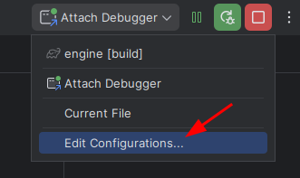
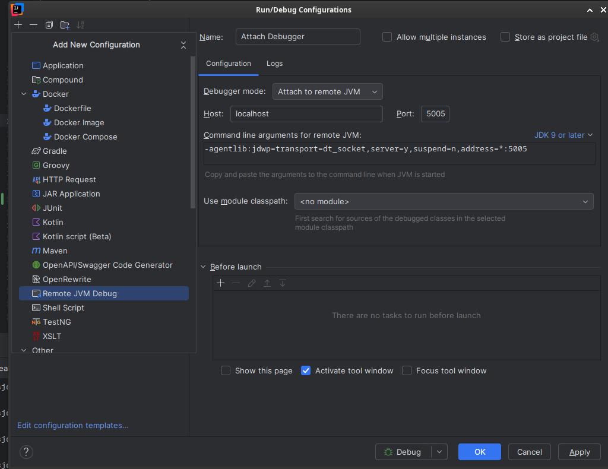
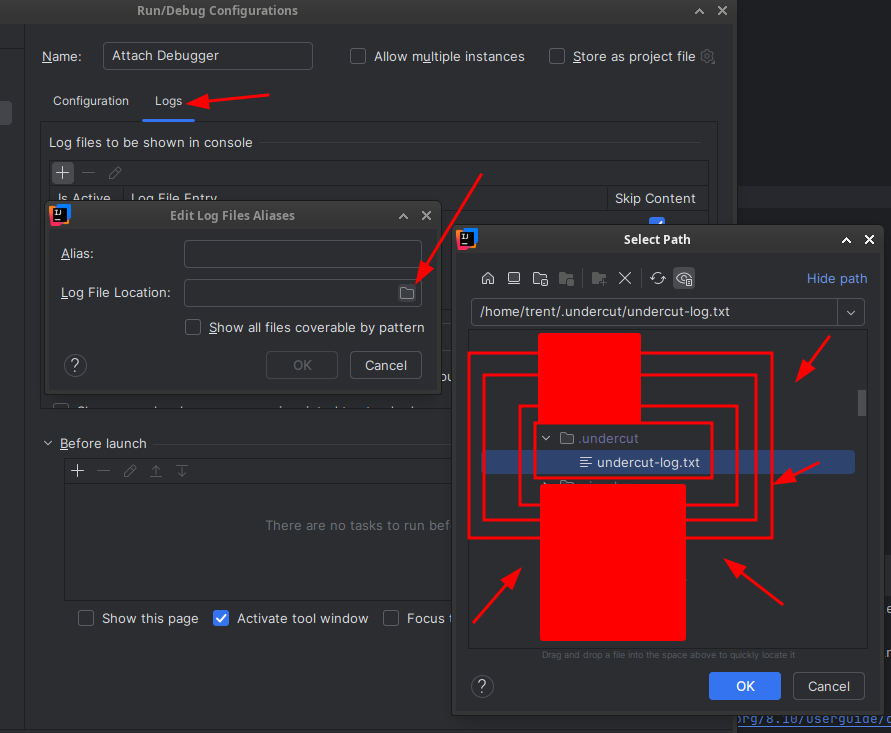

# Darkan-3-Undercut

An all-in-one platform for the **RS3 (RuneScape 3) NXT client** (`rs2client`). It unifies two
previously separate but tightly-related projects into one monorepo:

- **Darkan-3 server** — a Kotlin/JVM RS3 private server (Ktor networking, MongoDB, JS5 cache
  serving) plus a **Rust launcher + runtime patcher** that points the stock NXT client at the
  local server.
- **Undercut engine** — a Kotlin/JVM + C++20 **injection engine** that injects into the live
  `rs2client` process (funchook hooks, ImGui overlay, in-process MCP, a coroutine scripting
  framework, and a `TcpIn` network sniffer).

Both target the **same** NXT client binary, share one **knowledge hub** (`re-resources/`, a git
submodule), and are driven by **one all-in-one launcher** that patches the client (Darkan-3) **and**
injects the engine (Undercut) in a single step — **no network proxy required**.

> **Linux only.** There is no native Windows build. Windows users should use **WSL 2** — see
> [Running on Windows via WSL 2](#running-on-windows-via-wsl-2). · **Discord:** https://discord.gg/xZnszEdHdp

---

## Table of Contents

1. [Setup from a fresh install (copy-paste)](#setup-from-a-fresh-install-copy-paste)
   - [0. Before you start](#0-before-you-start)
   - [1. Install system packages — pick your distro](#1-install-system-packages--pick-your-distro)
   - [2. Install JDK 25 + Rust (all distros)](#2-install-jdk-25--rust-all-distros)
   - [3. Clone, configure, and build (all distros)](#3-clone-configure-and-build-all-distros)
2. [Populate the data folders](#populate-the-data-folders)
   - [4. Get the NXT client binaries](#4-get-the-nxt-client-binaries)
   - [5. Download the game cache (~24 GB)](#5-download-the-game-cache-24-gb)
3. [How to run it](#how-to-run-it)
   - [Option A — GUI launcher (all-in-one)](#option-a--gui-launcher-all-in-one)
   - [Option B — Manual dev flow](#option-b--manual-dev-flow)
4. [Engine script development](#engine-script-development)
5. [Build & run command reference](#build--run-command-reference)
6. [Architecture & repository layout](#architecture--repository-layout)
7. [Reverse-engineering tooling](#reverse-engineering-tooling)
8. [Troubleshooting](#troubleshooting)
9. [Running on Windows via WSL 2](#running-on-windows-via-wsl-2)
10. [License](#license)

---

## Setup from a fresh install (copy-paste)

This section is the complete setup, start to finish. Run section **1** for your distro, then **2**
and **3** verbatim (they're distro-agnostic). After this, the code is built but the `data/` folders
are still empty — that's [Populate the data folders](#populate-the-data-folders).

### 0. Before you start

The `re-resources` submodule is a **private GitLab repo pulled over SSH**, so you need an SSH key
registered with GitLab that can read `project-undercut/reclass-data` **before** cloning:

```bash
# Create a key if you don't have one, then add ~/.ssh/id_ed25519.pub to GitLab → Settings → SSH Keys
ssh-keygen -t ed25519 -C "$(whoami)@$(hostname)"
ssh -T git@gitlab.com    # should greet you by username
```

### 1. Install system packages — pick your distro

**Arch Linux:**

```bash
sudo pacman -Syu --needed git base-devel cmake clang gdb curl zip unzip sdl2
```

**Debian / Ubuntu:**

```bash
sudo apt update
sudo apt install -y git build-essential cmake clang gdb curl zip unzip libsdl2-dev
```

**Fedora:**

```bash
sudo dnf install -y git @development-tools cmake clang gdb curl zip unzip SDL2-devel
```

### 2. Install JDK 25 + Rust (all distros)

Distro JDK packages are often too old, so install **JDK 25** via SDKMAN and **Rust** via rustup:

```bash
# --- JDK 25 (Temurin) via SDKMAN ---
curl -s "https://get.sdkman.io" | bash
source "$HOME/.sdkman/bin/sdkman-init.sh"
sdk install java 25-tem

# --- Rust (stable) via rustup ---
curl --proto '=https' --tlsv1.2 -sSf https://sh.rustup.rs | sh -s -- -y
source "$HOME/.cargo/env"

# --- Make JAVA_HOME persistent (CMake/JNI + the inject scripts need it) ---
echo 'source "$HOME/.sdkman/bin/sdkman-init.sh"' >> "$HOME/.bashrc"
export JAVA_HOME="$(dirname "$(dirname "$(readlink -f "$(command -v java)")")")"
echo "export JAVA_HOME=\"$JAVA_HOME\"" >> "$HOME/.bashrc"

# --- Verify ---
java -version    # 25.x
cargo --version
cmake --version
```

### 3. Clone, configure, and build (all distros)

```bash
# --- Clone WITH submodules (re-resources, funchook, imgui, cs2-dumps) ---
git clone --recursive git@gitlab.com:project-undercut/engine.git darkan-3-undercut
cd darkan-3-undercut

# --- Configuration: copy the working dev .env (RSA keys, ports, tokens for the current 948 build) ---
cp .env.example .env

# --- Build the server + engine (JVM modules + native bootstrap .so + shadow/supervisor jars) ---
./gradlew build

# --- Build the GUI launcher (Rust) ---
( cd client/launcher && cargo build --release )

# --- Build + deploy the LD_PRELOAD patcher (must use this script, not bare cargo) ---
client/launcher/patcher/build.sh
```

That's everything compiled. If `git clone` complains about the submodule, fix SSH access (Section 0)
and run `git submodule update --init --recursive`.

> **What got built:**
> - `engine/build/libs/com.undercut-1.0.0-all.jar` — the injected engine jar
> - `engine/build/libs/libundercutbootstrap.so` — the native bootstrap (funchook + imgui)
> - `client/launcher/target/release/darkan-launcher` — the GUI launcher
> - `data/client/linux/libdarkan_patcher.so` — the LD_PRELOAD patcher (deployed to every slot)

---

## Populate the data folders

The build is done, but `data/client/` (the client binaries) and `data/cache/` (the JS5 cache) are
**gitignored and empty**. Two tools fill them.

### 4. Get the NXT client binaries

You need two files in `data/client/linux/`:

- `rs2client` — the NXT game client the engine injects into (~18 MB)
- `rs3linux`  — Jagex's bootstrapper binary (~9 MB)

These aren't shipped. The simplest source is the **GUI launcher itself**: build it (done in Step 3),
run it, and log in once — it downloads the current client from the Jagex CDN into its data dir.
Then copy them into the repo for the manual/dev flow:

```bash
./client/launcher/target/release/darkan-launcher    # log in once; it downloads the client, then quit

mkdir -p data/client/linux
cp ~/.local/share/darkan-launcher/Jagex/launcher/rs2client  data/client/linux/rs2client
cp ~/.local/share/darkan-launcher/rs3linux                  data/client/linux/rs3linux   # path may vary
chmod +x data/client/linux/rs2client data/client/linux/rs3linux

# Re-deploy the patcher now that data/client/linux exists (build.sh also targets that slot)
client/launcher/patcher/build.sh
```

If you already run RS3 via [Bolt Launcher](https://github.com/Adamcake/Bolt) or an official install,
you can copy the equivalent `rs2client`/`rs3linux` from there instead.

> The engine and patcher are **build-specific** (current: **948-5**). The client binary must match
> the offsets/keys baked into them. When Jagex bumps the build, both must be re-ported — see
> [Reverse-engineering tooling](#reverse-engineering-tooling).

### 5. Download the game cache (~24 GB)

The `:tools` cache downloader pulls the JS5 cache from Jagex's content servers into `./data/cache`
(the path the lobby/world/JS5 servers read, `CACHE_PATH` in `.env`):

```bash
./gradlew :tools:run
```

Override host/port/version/connections/output via `--args` (defaults shown):

```bash
./gradlew :tools:run --args="content.runescape.com 43594 948 2 8 ./data/cache"
#                              host                  port  maj min conns output
```

This is a large, long-running download — make sure you have ~24 GB free.

---

## How to run it

With the code built (Steps 1–3) and the data folders populated (Steps 4–5), pick one of two ways to
run.

### Option A — GUI launcher (all-in-one)

```bash
./client/launcher/target/release/darkan-launcher
```

The launcher handles Jagex OAuth2/PKCE login, downloads/updates the client, lets you pick a server
(Live vs. local custom), patches the client at launch, and can inject the engine — all from the UI.

### Option B — Manual dev flow

Best for server/engine development. Run the server, then patch+launch+inject via the scripts.

**1. Start the server** (two terminals, from the repo root). With `EMBEDDED_MONGO=true` in `.env`
(the default in `.env.example`), MongoDB runs in-process — no separate DB needed.

```bash
./gradlew :lobby:run      # login + JS5 + config server (port 8829) + worldlist + social
./gradlew :world:run      # world login, player/NPC sync, scene, game packets
```

**2. Patch + launch + inject** — the all-in-one script:

```bash
launch/run-undercut.sh                # patch + launch the client, then inject the engine (default)
launch/run-undercut.sh --no-engine    # patch + launch only (server testing, no injection)
launch/run-undercut.sh --no-patch     # inject into an already-running rs2client only
```

It LD_PRELOADs `libdarkan_patcher.so` (rewriting the client's RSA keys + server URLs to point at
your local Darkan-3), waits for `rs2client` to appear, then GDB-`dlopen`s the bootstrap (needs
`sudo` for GDB attach). Once injected you get the ImGui overlay, the in-process MCP server on
`:7882`, the scripting framework, and the `TcpIn` network sniffer. Knobs: `INJECT_DELAY=<sec>`
(default 8), `CONFIG_URI=<url>`.

**Other handy entry points:**

```bash
./run-client.sh           # patch + launch the client only (no engine; sources .env, LD_PRELOADs the patcher)
( cd engine && ./inject ) # manually inject into a running rs2client (lists PIDs, prompts; uses sudo)
```

---

## Engine script development

Scripts are Kotlin classes (annotated `@ScriptDescription`) packaged as JARs in `~/.undercut/scripts/`.
The engine auto-discovers and loads them at runtime. See `engine/example-script-module/`:

```bash
./gradlew :engine:example-script-module:build   # builds + copies the JAR to ~/.undercut/scripts/
```

> After **any** engine code change, rebuild the real artifact: `./gradlew :engine:shadowJar` (it
> bundles `:core`). `compileKotlin` alone leaves a stale injected jar.

### Hot-reload / remote debugging (JDWP)

The engine runs in the client's JVM with a JDWP listener on port **5005**, so you can attach
IntelliJ for live hot-swap:

1. **Run → Edit Configurations** → add a **Remote JVM Debug** config on port **5005**.
2. *(Optional)* **Logs** tab → add `~/.undercut/` as the log directory to see `println`/stack traces.
3. Start the client and inject first, then connect the debugger.





The pure-Java `engine-supervisor` loads the engine into a disposable `URLClassLoader`, so a rebuilt
shadow jar reloads without recreating the JVM.

---

## Build & run command reference

| Command | Description |
|---|---|
| `./gradlew build` | Full build: all JVM modules + native bootstrap + shadow/supervisor jars |
| `./gradlew projects` | List all Gradle modules |
| `./gradlew :lobby:run` | Run the lobby server (login/JS5/config/worldlist/social) |
| `./gradlew :world:run` | Run the world server (game state) |
| `./gradlew :tools:run` | Download the JS5 cache (default args) |
| `./gradlew :tools:rsaKeyGen` | Generate a fresh RSA key pair |
| `./gradlew :engine:shadowJar` | Build the engine injected jar (`com.undercut-1.0.0-all.jar`) |
| `./gradlew :engine:buildNativeBootstrap` | Build `libundercutbootstrap.so` only |
| `./gradlew :engine:example-script-module:build` | Build sample scripts → `~/.undercut/scripts/` |
| `./gradlew :engine:compileKotlin` | Fast Kotlin error check (no deployable jar) |
| `( cd client/launcher && cargo build --release )` | Build the GUI launcher |
| `client/launcher/patcher/build.sh` | Build + deploy the LD_PRELOAD patcher |
| `launch/run-undercut.sh` | Patch + launch + inject (all-in-one) |
| `./run-client.sh` | Patch + launch the client only |
| `engine/inject` | Inject the engine into a running `rs2client` |

### `.env` configuration

`.env` (copied from `.env.example`) ships a working, internally-consistent key set for the current
**948** build. See `core/src/main/kotlin/org/darkan/core/EnvVars.kt` for every variable + default.

| Variable | Purpose |
|---|---|
| `RSA_JS5_MODULUS` / `_EXPONENT` | 4096-bit key signing the JS5 master index |
| `RSA_LOGIN_MODULUS` / `_EXPONENT` | 1024-bit key for login-block encryption |
| `DARKAN_RSA_MODULUS` / `DARKAN_JS5_RSA_MODULUS` | **Hex** moduli the patcher writes into `rs2client` |
| `DARKAN_HTTP_PORT` | Config/ConfigServer HTTP port (default `8829`) |
| `EMBEDDED_MONGO` | `true` → in-process mongod (no MongoDB install) |
| `CACHE_PATH` | JS5 cache location (default `./data/cache`) |
| `SOCIAL_GATEWAY_TOKEN` / `WORLD_LOGIN_TOKEN_SECRET` | Lobby↔world secrets (required unless `DEBUG=true`) |

> **Rotating keys (advanced):** `./gradlew :tools:rsaKeyGen`, then update **both** the decimal moduli
> (server) and the hex `DARKAN_*` moduli (patcher) in `.env`, and rebuild the patcher. The patcher
> source also pins the *stock Jagex* key it searches for; that only changes when a new client build
> rotates Jagex's key.

---

## Architecture & repository layout

```
darkan-3-undercut/
├── core/   lobby/   world/   tools/        # Darkan-3 server (Gradle modules)
│                                           #   core   — net protocol, codecs, cache library, mongo
│                                           #   lobby  — login + JS5 + config + worldlist + social
│                                           #   world  — world login, player/NPC sync, scene, game packets
│                                           #   tools  — cache downloader, client updater, RSA keygen, diag
├── engine/                                 # Undercut injection engine (:engine Gradle module)
│   ├── src/main/kotlin/com/undercut/…      #   cache, game/nxt, hooks, mcp, script, ui, scene
│   ├── native-bootstrap/                   #   C++20 bootstrap (funchook + imgui submodules) → .so
│   ├── example-script-module/              #   :engine:example-script-module (sample bot scripts)
│   └── inject                              #   standalone GDB-dlopen injector script
├── engine-supervisor/                      # Tiny pure-Java hot-reload supervisor (system classpath)
├── client/launcher/                        # Rust launcher (darkan-launcher) + runtime patchers
│   ├── src/                                #   OAuth, client download, webview UI, IPC
│   ├── patcher/                            #   Linux LD_PRELOAD patcher → libdarkan_patcher.so
│   ├── patcher-win/  patcher-mac/          #   Windows DLL / macOS dylib equivalents
│   └── ui/                                 #   launcher webview assets (HTML/CSS/JS)
├── data/                                   # NXT client binaries + JS5 cache  (BOTH gitignored)
├── re-resources/         (SUBMODULE)       # Unified RE knowledge hub (docs, symbols, gamevals, cs2-dumps)
├── launch/run-undercut.sh                  # ALL-IN-ONE launcher script (patch + launch + inject)
├── run-client.sh                           # Patch + launch the client only
├── bridge_mcp_ghidra.py                    # Ghidra MCP bridge
├── .env.example                            # Copy to .env (RSA keys, ports, tokens)
└── settings.gradle.kts  build.gradle.kts   # Unified Gradle build (Kotlin 2.3.20, JDK 25)
```

`./gradlew projects` →
`:core :lobby :world :tools :engine :engine:example-script-module :engine-supervisor`.

---

## Reverse-engineering tooling

This project reverse-engineers `rs2client` with **Ghidra** via the GhidraMCP bridge
(`bridge_mcp_ghidra.py`, wired up in `.mcp.json`). Shared RE knowledge lives in the `re-resources/`
submodule:

- `re-resources/docs/` (= the top-level `docs/` symlink) — protocol, cache, binary, and engine docs.
- `re-resources/symbols/` — RE symbol dumps (pattern-matching / namespace discovery only).
- `re-resources/gamevals/` — cache id ↔ dev-name dictionaries (`./re-resources/gamevals/gameval.py npc 7987`).
- `re-resources/cs2-dumps/` — decompiled CS2 clientscripts + item/npc/loc/struct/enum JSON dumps.

When a new client build lands, engine offsets
(`engine/src/main/kotlin/com/undercut/game/nxt/Offsets.kt`) and the patcher keys must be re-ported.
See `re-resources/docs/re-methodology/UPDATING.md`, `re-resources/CROSS_VERSION_MIGRATION.md`, and
`CLAUDE.md` for the full RE workflow and agent roster.

---

## Troubleshooting

**Submodule clone fails / `re-resources` is empty.** You need a GitLab SSH key with access to
`project-undercut/reclass-data` (Section 0). Then `git submodule update --init --recursive`.

**`JAVA_HOME must be set` during inject.** Export `JAVA_HOME` to a JDK 25 home before running
`launch/run-undercut.sh` or `engine/inject` (Section 2 makes it persistent).

**Native bootstrap fails to configure.** Confirm `cmake`, `clang`/`clang++`, the JNI headers (via
`JAVA_HOME`), and `SDL2` are installed, and that the `funchook`/`imgui` submodules are checked out
(`git submodule update --init --recursive`).

**The client launches but isn't patched / disconnects after the master index.** A stale
`libdarkan_patcher.so` is shadowing a fresh build, or patcher env vars are missing. Always rebuild
via `client/launcher/patcher/build.sh` (it verifies the current-build marker and refreshes every
deploy slot), and make sure `.env` sets `DARKAN_RSA_MODULUS`, `DARKAN_JS5_RSA_MODULUS`, and
`DARKAN_HTTP_PORT`. Diagnose via `~/.darkan3/launcher-client.log`.

**The client is randomly `SIGKILL`ed (no core, no crash log).** The kernel is enforcing
`RLIMIT_RTTIME` (a 200 ms realtime-thread cap set by `rtkit-daemon`) on the game's render thread
during a long GPU stall — it happens uninjected too. Immediate fix:

```bash
sudo prlimit --pid "$(pgrep -nx rs2client)" --rttime=unlimited:unlimited
```

Persistent fix: `systemctl edit rtkit-daemon` and raise `--rttime-usec-max` on `ExecStart`.

**No core dump on an engine crash.** The inject scripts already `prlimit --core=unlimited`; the dump
goes wherever `/proc/sys/kernel/core_pattern` points (`coredumpctl debug` with systemd-coredump).

---

## Running on Windows via WSL 2

There is no native Windows engine; run the whole stack inside **WSL 2 with Arch Linux**.
**Video guide:** https://www.youtube.com/watch?v=ql959hpUTP0

1. [Enable virtualization in BIOS](https://www.youtube.com/watch?v=rrpzWCPatLo) and
   [enable WSL 2 in Windows Features](https://www.youtube.com/watch?v=eId6K8d0v6o).
2. Install [Arch Linux from the Microsoft Store](https://apps.microsoft.com/detail/9mznmnksm73x),
   launch it, and create a user.
3. Set up an X server for the overlay (e.g. VcXsrv) and point `DISPLAY` at it.
4. Follow [Setup from a fresh install](#setup-from-a-fresh-install-copy-paste) (Arch) and the rest
   of this guide normally.

> If you hit `No Authorization protocol found` under an X-based WM:
> ```bash
> sudo pacman -S xorg-xhost && xhost +local:
> ```

---

## License

See [LICENSE](LICENSE).
